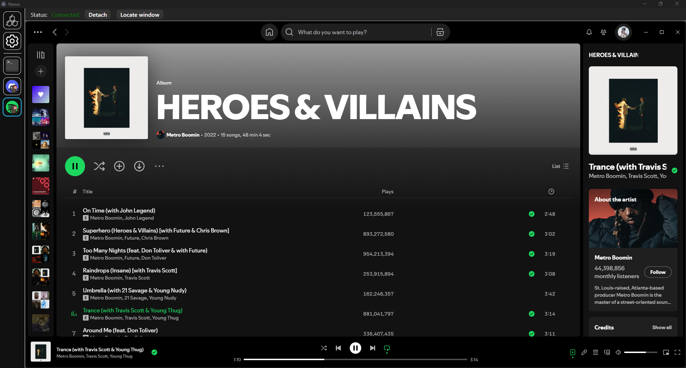

<h1 align="center">Aaron Burnham</h1>
<h3 align="center">Software Engineer</h3>

    <a href="https://aarontburn.github.io/">
        https://aarontburn.github.io/
    </a>

    aarontburn@outlook.com

# [Nexus](https://github.com/aarontburn/nexus-core)

**Nexus** is an cross-platform application environment and loader. Load applications, or **modules**, created for the Nexus environment quickly and have quick access to them. Or, develop modules using TypeScript that can do anything you want it to do.

Think of **Nexus** as a customizable toolbox — one app that can do anything that you (or the community) build into it.

## Nexus Modules

| Name | Description |
|--------|-------------|
| [Monkey Core](https://github.com/aarontburn/nexus-monkey-core) | A library for managing third-party windows in Nexus. |
| [Discord Monkey](https://github.com/aarontburn/nexus-discord-monkey) | Embed your Discord client within Nexus. |
| [Github Desktop Monkey](https://github.com/aarontburn/nexus-github-desktop-monkey) | Embed your GitHub Desktop client within Nexus. |
| [Spotify Monkey](https://github.com/aarontburn/nexus-spotify-monkey) | Control and view your Spotify desktop client from within Nexus. |
| [Debug Console](https://github.com/aarontburn/nexus-debug-console) | View Nexus logs and run internal commands. |
| [Debug Console Extras](https://github.com/aarontburn/nexus-debug-console-extras) | Adds additional commands to the [Debug Console](https://github.com/aarontburn/nexus-debug-console) module. |
| [Volume Controller](https://github.com/aarontburn/nexus-volume-controller) | **[Windows Only]** Control application volume, mute apps, or isolate sound. |
| [ChatGPT](https://github.com/aarontburn/nexus-chatgpt) | Access ChatGPT directly inside Nexus for AI-assisted tasks and conversations. |
| [Google Gmail](https://github.com/aarontburn/nexus-google-gmail) | Check and manage your Gmail inbox without leaving Nexus. |
| [Microsoft Outlook](https://github.com/aarontburn/nexus-microsoft-outlook) | View and manage your Outlook emails from within Nexus. |
| [Google Calendar](https://github.com/aarontburn/nexus-google-calendar) | Keep track of events and meetings using the embedded Google Calendar. |

## Nexus Developer Templates

| Name | Description |
|--------|-------------|
| [React Template](https://github.com/aarontburn/nexus-template-react) | Develop a module for Nexus using Vite + React + TypeScript |
| [Webpage Template](https://github.com/aarontburn/nexus-template-webpage) | Develop a module for Nexus using an existing webapp. |
| [Vanilla TS Template](https://github.com/aarontburn/nexus-template-vanilla-ts) | Develop a module for Nexus using HTML + TypeScript + CSS |
| [Internal Template](https://github.com/aarontburn/nexus-template-internal) | Develop an internal (no GUI) module for Nexus using TypeScript. |

